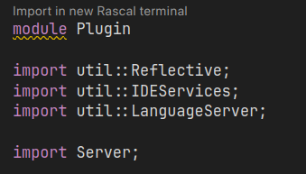
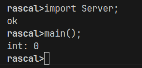
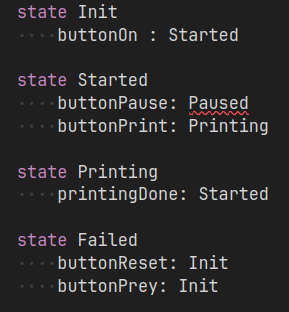
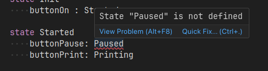
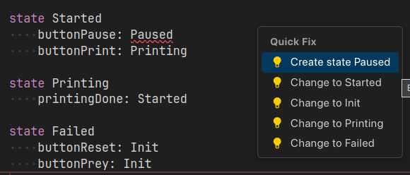
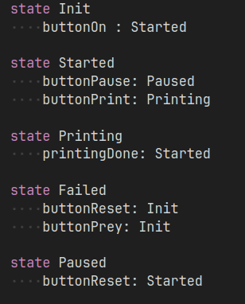
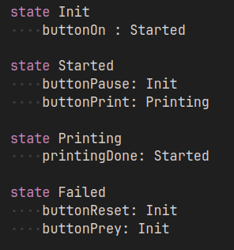
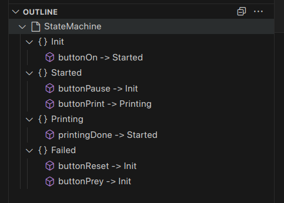
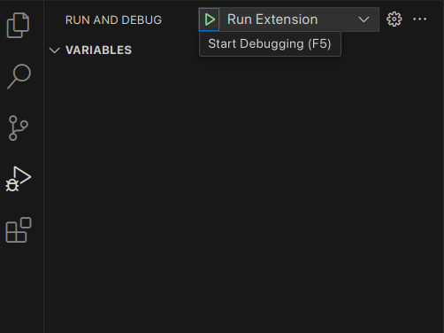

# Rascal introduction

In this project we have a simple state-machine language to help you become more familiar with Rascal and VS code.

After opening the project in VS code, open the src/Plugin.rsc file and click on "import in new rascal terminal".



Then run the main() function in that terminal and we have syntax highlighting for the statemachine language.



## Useful commands

```rascal
import ParseTree;
import Syntax;
import Parser;

start[Machine] myStartMachine = parse(|project://statemachine/src/examples/example.sm|);
Machine myMachine = myStartMachine.top;

import Analyze;

myStartMachine = parse(|project://statemachine/src/examples/unreacheable.sm|);
myMachine = myStartMachine.top;

unreachableIds = unreachable(myMachine);

import Compile;
compile(myMachine);

import Plugin;
main();

clearMyLang();

// Also see https://www.rascal-mpl.org/docs/WhyRascal/UseCases/DomainSpecificLanguages/#syntax-definitions-and-parsing
```

Note that the `example.sm` file has no unreachable states, but `unreacheable.sm` does; it never goes to the Failed state.

## The example code

The example code looks like this by default.



It shows that we can also create more complex language features such as error detectors, with the help of the language server tool.

By hovering over the squiggly lines, we are able to read the error message.



And by clicking in "quick fix" we have some suggestions:



Finally, we have possible solutions, either by changing the state to a valid one or creating the missing state:




One last detail, this project contains an example of how to add the outline of the statemachine file to the language server. It can be seen in the left menu.



## Create your own VS code extension

Based on the example provided by the rascal-lsp repo, we can also generate a VS Code extension for our language.
This is available in the `statemachine-extension` project.

To compile the extension, you can run `npx vsce package` in the root directory of the project.
This will create a `.vsix` archive that is the extension itself, which can be installed in VS Code.

During development, this is not very handy, but there is a faster option.

It is possible to compile the rascal part with `npm run package` and then test the extension by running the debug task "Run Extension".
If it complains about something, just click to continue.



This will start a new instance of VS Code with the extension loaded.
Either in debug mode or with the installation, all of the LSP features are now available.
